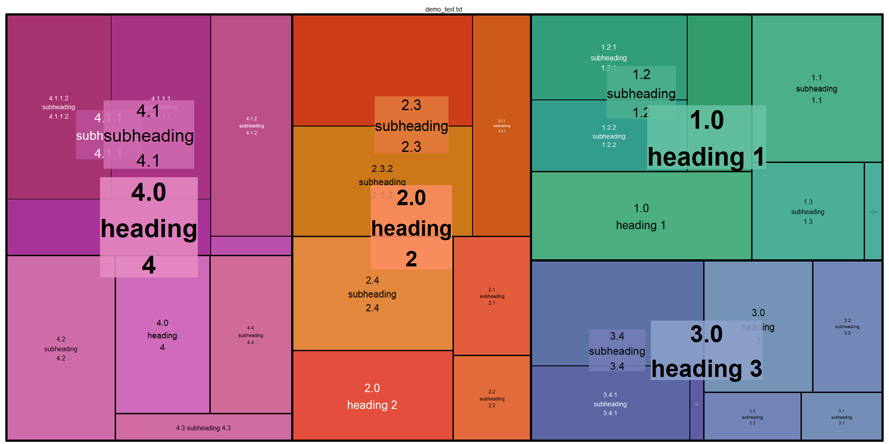

# doc_to_tree_map
Create a treemap visualizing characters counts in a Microsoft Word document section

# Overview
Use the [python-docx](https://pypi.org/project/python-docx/) python library to extract character counts by document section from a [Microsoft Word Document](https://en.wikipedia.org/wiki/Microsoft_Word) and the [treemap](https://cran.r-project.org/package=treemap) R library to visualize the relative sizes of each section.

# Microsoft Word Documents
Microsoft Word Documents feature the ability to mark text as headings. These headings help orient the reader (and the document author!) to the structure of the document.

Text marked as *Heading 2* is considered a sub-section of text marked as *Heading 1*. Headings and sub-headings are the major and minor sections of a paper. In a typical technical document or report, the headings and sub headings might look something like this:

- Introduction
- Previous Studies
    - Study 1
    - Study 2
    - Study 3
- Methodology
    - Test 1
    - Test 2
- Results
    - Result 1
        - Possible Counterfactual 1
    - Result 2
        - Possible Counterfactual 2
- Conclusion
    - Discussion        
    - Overview
    - Recommendations for Future Study 
    
Accordingly, a technical document's narrative is ordered and hierarchical. By treating the count of words (or characters) in each section and sub-section as data, we can visualize the size of each section and sub-section relative to each other section and sub-section. 

# Treemaps
"Treemap is a space-constrained visualization of hierarchical structures. It is very effective in showing attributes of leaf nodes using size and color coding. Treemap enables users to compare nodes and sub-trees even at varying depth in the tree, and help them spot patterns and exceptions." [Source](https://www.cs.umd.edu/hcil/treemap/)

Given that definition of the visualization - comparing nodes and sub-trees - we can understand a treemap of a technical document as a visual representation of the document's table of contents. In this regard, a treemap from a technical document is meant to show relative sizes of a technical document and not assist with the research described in the technical document. However, it could be used to identify overly-verbose or under represented sections of a document and in turn help sharpen exposition. 

The treemap visualization holistically captures document changes and growth more so than a page-count or a word-count. To that end, I have included the ability to record these changes over time in one of the scripts below.

# Usage
There are three scripts included with this repo:
* [part_01_create_demo_data_for_treemap.ipynb](part_01_create_demo_data_for_treemap.ipynb)
This script uses the [python-lorem](https://pypi.org/project/python-lorem/) package to create *lorem ipsum* text under a set of manually defined headings. The [python-docx](https://pypi.org/project/python-docx/) python library is used to write the *lorem ipsum* text and the headings to a Word document: [demo_text.docx](demo_text.docx). Note that `np.random.randint()` is used to create variation in the size of each section and sub-section. Accordingly, subsequent runs will generate differently sized Word documents and treemaps. 

* [part_02_extract_data_for_treemap.ipynb](part_02_extract_data_for_treemap.ipynb)
This script will read a Word document, count the number of characters in each section, and format the data for use in a treemap. There is a switch `use_demo=True` that directs the control to work with either the [demo_text.docx](demo_text.docx) or a user-specified Word document. `use_demo=True` writes the formatted output to [demo_text.txt](demo_text.txt) and `use_demo=False` writes the formatted output to a file titled something like *chapter_data_2025_09_07_13_47_52.txt*. This is done so that treemaps can be made from a single document throughout the day to help visualize progress. As technical documents grow and change over time, the point-in-time treemaps reflect those changes.

* [part_03_create_treemap.R](part_03_create_treemap.R)
This is the script that creates the treemap visualization. Again, there is a flag `use_demo=TRUE` indicating if the [demo_text.txt](demo_text.txt) file should be used or the user supplied file should be used. The image above uses [demo_text.txt](demo_text.txt) and saved as [demo_text.png](demo_text.png). User supplied files are saved as *chapter_data_2025_09_07_13_47_52.png* to showcase the point-in-time visualization of a technical document.

# Limitations and conclusion
Headings are absolutely necessary for the treemap. Documents without headings will not work. Accordingly, technical documents work better for visualization than non-technical documents because technical documents have more headings and sub-headings. Non-technical manuscripts do not usually feature sub-headings. However, with adequately styled non-technical manuscripts (e.g. chapter 1, chapter 2...), these scripts can most certainly be used.

Happy tree-mapping! Each script takes a few seconds to run and can be tailored for specific uses. 